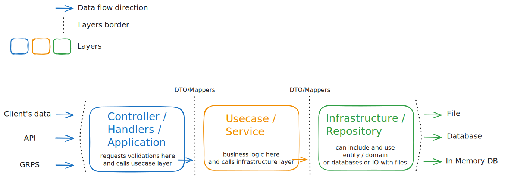

<!-- Improved compatibility of back to top link: See: https://github.com/othneildrew/Best-README-Template/pull/73 -->
<a id="readme-top"></a>
<!--
*** Thanks for checking out the Best-README-Template. If you have a suggestion
*** that would make this better, please fork the repo and create a pull request
*** or simply open an issue with the tag "enhancement".
*** Don't forget to give the project a star!
*** Thanks again! Now go create something AMAZING! :D
-->

<!-- PROJECT SHIELDS -->
<!--
*** I'm using markdown "reference style" links for readability.
*** Reference links are enclosed in brackets [ ] instead of parentheses ( ).
*** See the bottom of this document for the declaration of the reference variables
*** for contributors-url, forks-url, etc. This is an optional, concise syntax you may use.
*** https://www.markdownguide.org/basic-syntax/#reference-style-links
-->
[![Issues][issues-shield]][issues-url]
[![MIT License][license-shield]][license-url]

<!-- PROJECT LOGO -->
<br />
<div align="center">
  <!-- <a href="https://github.com/iqhater/clean-arch-basic-example">
    
  </a> -->

<h3 align="center">Clean Arch Basic Example</h3>

  <p align="center">
    Clean architecture with a basic greeter API service example
    <br />
    <!-- <a href="https://github.com/iqhater/clean-arch-basic-example"><strong>Explore the docs »</strong></a> -->
    <br />
    <br />
    <a href="https://github.com/iqhater/clean-arch-basic-example">View Example</a>
    ·
    <a href="https://github.com/iqhater/clean-arch-basic-example/issues/new?labels=bug&template=bug-report---.md">Report Bug</a>
    ·
    <a href="https://github.com/iqhater/clean-arch-basic-example/issues/new?labels=enhancement&template=feature-request---.md">Request Feature</a>
  </p>
</div>

<!-- TABLE OF CONTENTS -->
<details>
  <summary>Table of Contents</summary>
  <ol>
    <li>
      <a href="#about-the-project">About The Project</a>
      <ul>
        <li><a href="#built-with">Built With</a></li>
      </ul>
    </li>
    <li>
      <a href="#getting-started">Getting Started</a>
      <ul>
        <li><a href="#prerequisites">Prerequisites</a></li>
        <li><a href="#installation">Installation</a></li>
      </ul>
    </li>
    <li><a href="#usage">Usage</a></li>
    <li><a href="#roadmap">Roadmap</a></li>
    <li><a href="#contributing">Contributing</a></li>
    <li><a href="#license">License</a></li>
    <li><a href="#contact">Contact</a></li>
  </ol>
</details>

<!-- ABOUT THE PROJECT -->
## About The Project

Graph generated by `go-arch-lint` utility
[![Product Name Screen Shot][product-screenshot]](https://example.com)

<p align="right">(<a href="#readme-top">back to top</a>)</p>

### Built With

* [![Go][go.dev]][Go-url]

<p align="right">(<a href="#readme-top">back to top</a>)</p>

<!-- GETTING STARTED -->
## Getting Started

Setting up your project locally.
To get a local copy up and running follow these simple example steps.

### Prerequisites

Prepare some useful tools for project development

* install project dependencies (Taskfile and go-arch-lint)

[Taskfile](https://taskfile.dev/installation/) _`*recommended`_ </br>
[golangci-lint](https://golangci-lint.run/welcome/install/) _*optional_ </br>
[go-arch-lint](https://github.com/fe3dback/go-arch-lint) _*optional_

### Installation

1. Clone the repo

   ```sh
   git clone https://github.com/iqhater/clean-arch-basic-example.git
   ```

2. Install project dependencies

   ```sh
   task install
   ```

3. Change git remote url to avoid accidental pushes to base project

   ```sh
   git remote set-url origin iqhater/clean-arch-basic-example
   git remote -v # confirm the changes
   ```

4. Add `.env` file to project root. See `.env.example`

5. *Optional Fel free to edit `Taskfile` binary name, module name and entrypoint path if you wish.

   ```yml
    MODULE_NAME: greeter_api

    # Binary name
    BINARY_NAME: greeter_api

    # App entrypoint path
    APP_ENTRYPOINT: ./cmd/greeter
   ```

6. Build and run project

   ```sh
   task run
   ```

<p align="right">(<a href="#readme-top">back to top</a>)</p>

<!-- USAGE EXAMPLES -->
## Usage

Clean arch data flow concept schema
[![Clean Arch Schema Concept][schema-concept]](https://bloghugocoutinho.wordpress.com/wp-content/uploads/2020/05/cleanarchitecture-1.jpg)

### Taskfile useful commands

Run all tests

```sh
task test
```

Run project linter

```sh
task lint
```

Remove all binaries

```sh
task clean
```

<p align="right">(<a href="#readme-top">back to top</a>)</p>

<!-- ROADMAP -->
## Roadmap

* [ ] Deploy openapi static docs located at the `/api` folder
* [ ] Deploy greeter API service

See the [open issues](https://github.com/iqhater/clean-arch-basic-example/issues) for a full list of proposed features (and known issues).

<p align="right">(<a href="#readme-top">back to top</a>)</p>

<!-- CONTRIBUTING -->
## Contributing

Contributions are what make the open source community such an amazing place to learn, inspire, and create. Any contributions you make are **greatly appreciated**.

If you have a suggestion that would make this better, please fork the repo and create a pull request. You can also simply open an issue with the tag "enhancement".
Don't forget to give the project a star! Thanks again!

1. Fork the Project
2. Create your Feature Branch (`git checkout -b feature/AmazingFeature`)
3. Commit your Changes (`git commit -m 'Add some AmazingFeature'`)
4. Push to the Branch (`git push origin feature/AmazingFeature`)
5. Open a Pull Request

<p align="right">(<a href="#readme-top">back to top</a>)</p>

### Top contributors

<a href="https://github.com/iqhater/clean-arch-basic-example/graphs/contributors">
  
</a>

<!-- LICENSE -->
## License

Distributed under the MIT License. See `LICENSE.txt` for more information.

<p align="right">(<a href="#readme-top">back to top</a>)</p>

<!-- CONTACT -->
## Contact

email - <iqhater@yandex.ru>

Project Link: [https://github.com/iqhater/clean-arch-basic-example](https://github.com/iqhater/clean-arch-basic-example)

<p align="right">(<a href="#readme-top">back to top</a>)</p>

<!-- MARKDOWN LINKS & IMAGES -->
<!-- https://www.markdownguide.org/basic-syntax/#reference-style-links -->
[issues-shield]: https://img.shields.io/github/issues/iqhater/clean-arch-basic-example.svg?style=for-the-badge
[issues-url]: https://github.com/iqhater/clean-arch-basic-example/issues
[license-shield]: https://img.shields.io/github/license/iqhater/clean-arch-basic-example.svg?style=for-the-badge
[license-url]: https://github.com/iqhater/clean-arch-basic-example/blob/main/LICENSE.txt
[product-screenshot]: go-arch-lint-graph.svg
[schema-concept]: clean_arch_concept_go_vector.svg
[go.dev]: https://img.shields.io/badge/golang-00ADD8?style=for-the-badge&logo=go&logoColor=white
[Go-url]: https://go.dev
